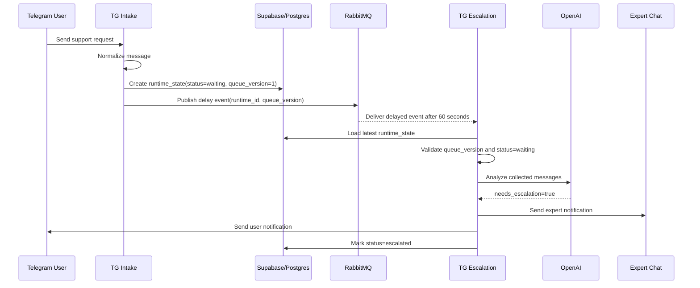
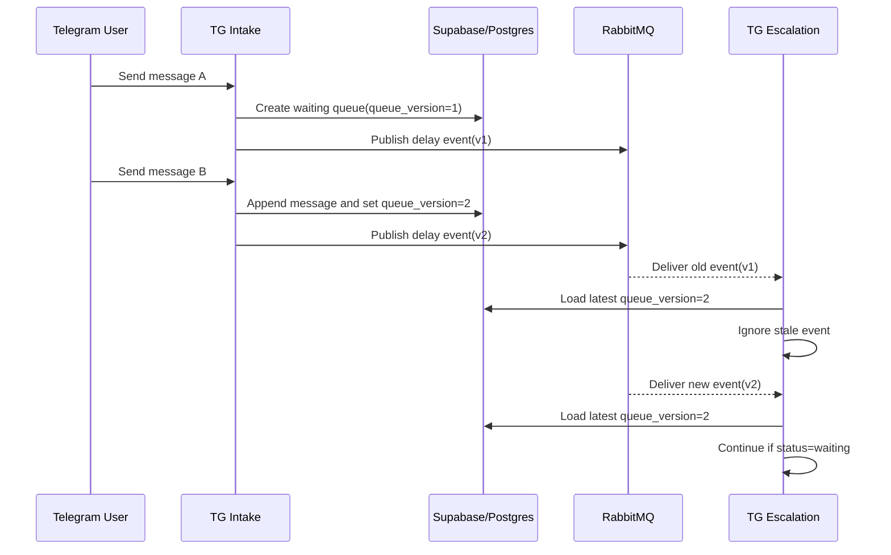

# End-to-End Flow

## Purpose

This document describes the complete Telegram Support Agent MVP message lifecycle from a Telegram group message to the final runtime status. It documents the current workflow behavior only and does not introduce workflow, database, runtime, or service changes.

## Main Happy Path

1. A normal user sends a support request in a Telegram group.
2. `TG Intake` normalizes the Telegram message.
3. `TG Intake` creates `runtime_state` with `status = waiting`.
4. `TG Intake` publishes a RabbitMQ delay event with `runtime_id` and `queue_version`.
5. No expert replies within 60 seconds.
6. `TG Escalation` consumes the delayed event.
7. `TG Escalation` validates that RabbitMQ `queue_version` matches the database `queue_version` and that `status = waiting`.
8. AI analysis returns `needs_escalation = true`.
9. Experts are notified.
10. The user is notified.
11. Runtime status becomes `escalated`.

## Expert Reply Path

1. A normal user sends a message.
2. Runtime status is `waiting`.
3. An expert replies before the timer expires.
4. `TG Intake` detects the expert and marks waiting queues in the chat as `answered_by_expert`.
5. The delayed RabbitMQ event later becomes irrelevant because the database status is no longer `waiting`.

## Stale Timer Path

1. User sends message A.
2. `queue_version = 1` is published in a RabbitMQ delay event.
3. User sends message B before the timer expires.
4. `TG Intake` appends message B and increments `queue_version` to `2`.
5. The old delayed event with `queue_version = 1` is ignored.
6. The newer delayed event with `queue_version = 2` can proceed.

## Ignored Path

1. User sends only a greeting, thanks, acknowledgement, small talk, or a message without a request, problem, or question.
2. `TG Escalation` AI analysis returns `needs_escalation = false`.
3. Runtime status becomes `ignored`.
4. No expert or user notification is sent.

## Design Guarantees

- No long-running n8n execution is needed for the 60-second wait.
- Supabase/Postgres remains the source of truth.
- RabbitMQ events are only triggers, not the source of truth.
- OpenAI is used only in `TG Escalation`.
- User-facing response language is based on detected language.
- Expert-facing message language is Ukrainian.

## Current MVP Limitations

- Expert replies currently close all waiting queues in the chat.
- Telegram send failures are not yet transactionally tied to `Mark Escalated`.
- Expert chat ID should become configurable.
- Workflow exports may contain credential references and must be reviewed before sharing.
